<h1>Active Directory Lab Guide</h1>

<h2>Description</h2>
A walkthrough guide for creating a simple active directory lab in Azure.
<br />

<h2>Environments Used </h2>

- <b>Windows 11</b> (22H2)
- <b>Windows Server 2025</b>
- <b>Microsoft Azure</b>

<h2>Walk-through:</h2>

<p align="center">
<h2>1.	Creating the Virtual Machine </h2><br/>
<b>Begin by provisioning a Windows Server virtual machine within a newly created Resource Group. For this example, I selected Windows Server 2025 Datacenter (Gen2) and named the Resource Group HomeLab for clear identification and management. Next, deploy a Windows 11 client VM using the same procedure; ensure the Windows 11 instance is placed in the identical Resource Group, virtual network, and subnet so both machines can communicate on the same network for Active Directory configuration. </b>
<br />
<br />
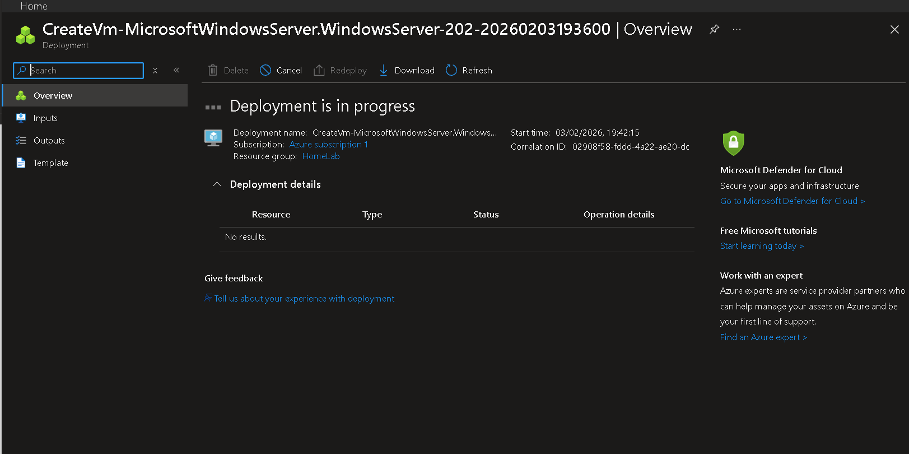
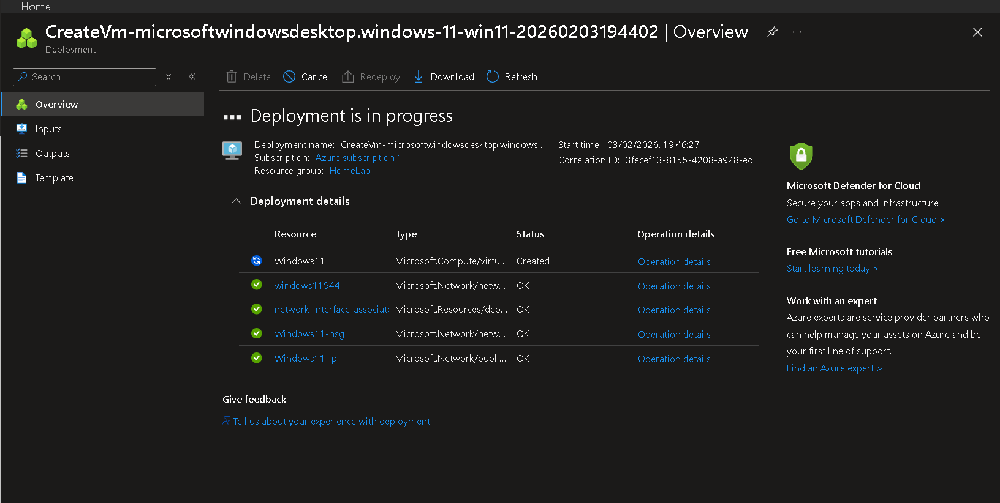
<br />
<br />
  
<h2>2.	Logging into the Server and Enabling Active Directory Services  </h2><br/>
<b>After deployment, connect to the newly created server via Remote Desktop. Install the Active Directory Domain Services (AD DS) role and promote the server to a Domain Controller. </b>
<br />
<br />
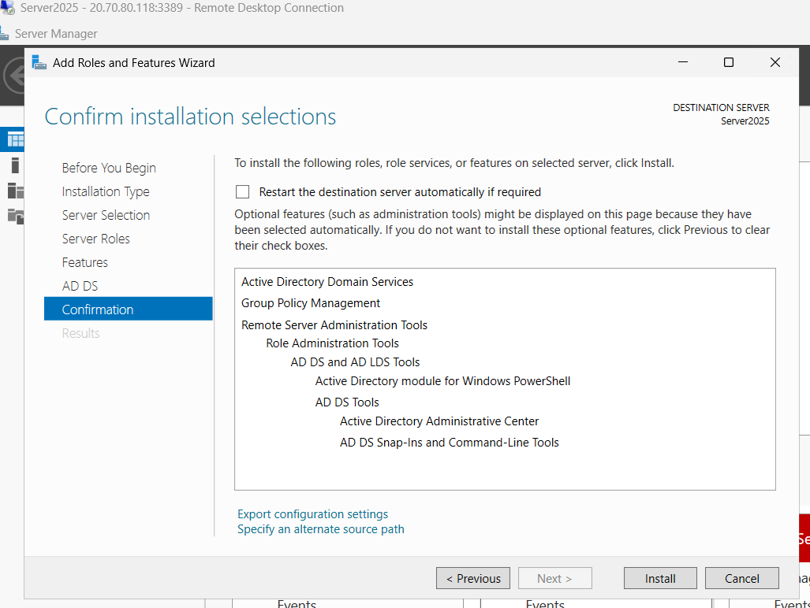
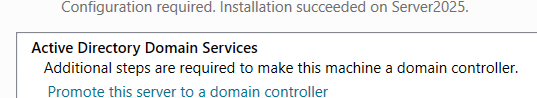
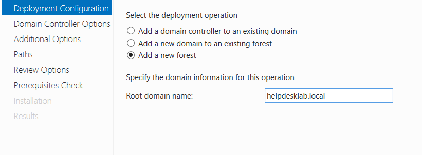
<b>For this setup, the domain was named helpdesklab.local and AD DS was deployed using the default configuration settings.</b>
<br />
<br />
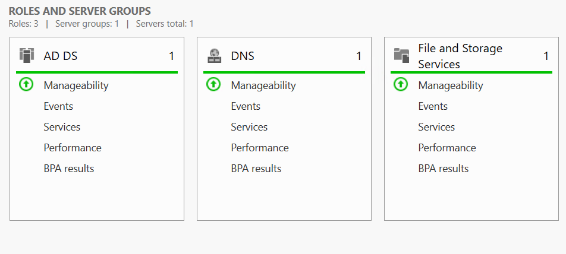
<br />
<b> Ensure DNS is installed and replicated as part of the promotion, and verify the server is functioning as the primary Domain Controller before proceeding. </b>
<br />
<br />
  
<h2>3.	Creating and onboarding a new user </h2><br/>
<b>Reboot the Domain Controller and wait for Active Directory services to complete initialization. Open Active Directory Users and Computers on the Domain Controller and create a new user (example: john.d). Assign any required group memberships and set an initial password with appropriate complexity and the option to require password change at first logon. </b>
<br />
<br />
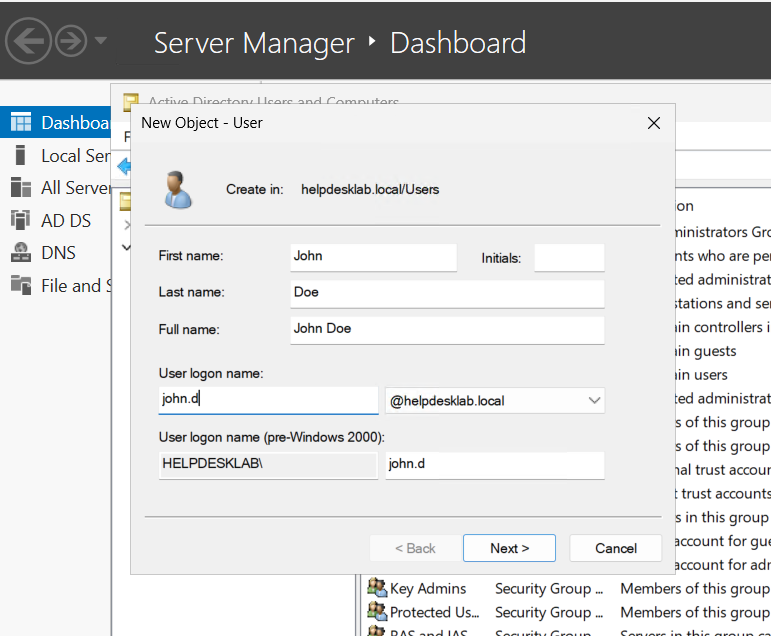
<b>On the Windows 11 VM, sign in as the administrator and open Settings → About → Rename this PC (or Change workgroup/domain). Choose to join a domain and enter helpdesklab.local, then provide the credentials for the newly created domain account or an account with permission to join machines to the domain (typically a domain admin). Reboot the client when prompted. RDP into the Windows 11 machine as the administrator, open System Properties → Remote, and enable Remote Desktop. Add the new user (john.d) to the Remote Desktop Users group or grant Remote Desktop access via the Settings UI.</b>
<br />
<br />
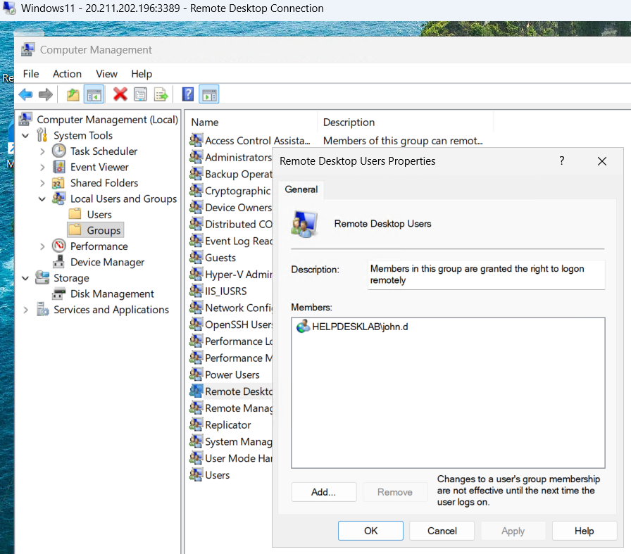
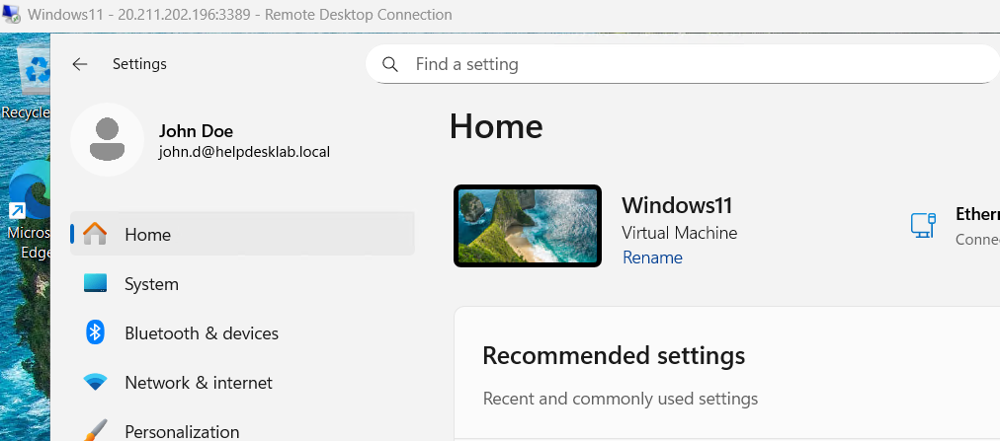
<br />
<b>Sign out of the administrator account and sign in using the new domain user credentials to confirm the account can log in and that Remote Desktop access works. </b>
<br />
<br />
  
<h2>4.	Enabling file sharing  </h2><br/>
<b>On the server, open File and Storage Services → Shares. Right click and select New Share, choose SMB Quick, and complete the wizard to create the share (example name: helpdesklab.local). </b>
<br />
<br />
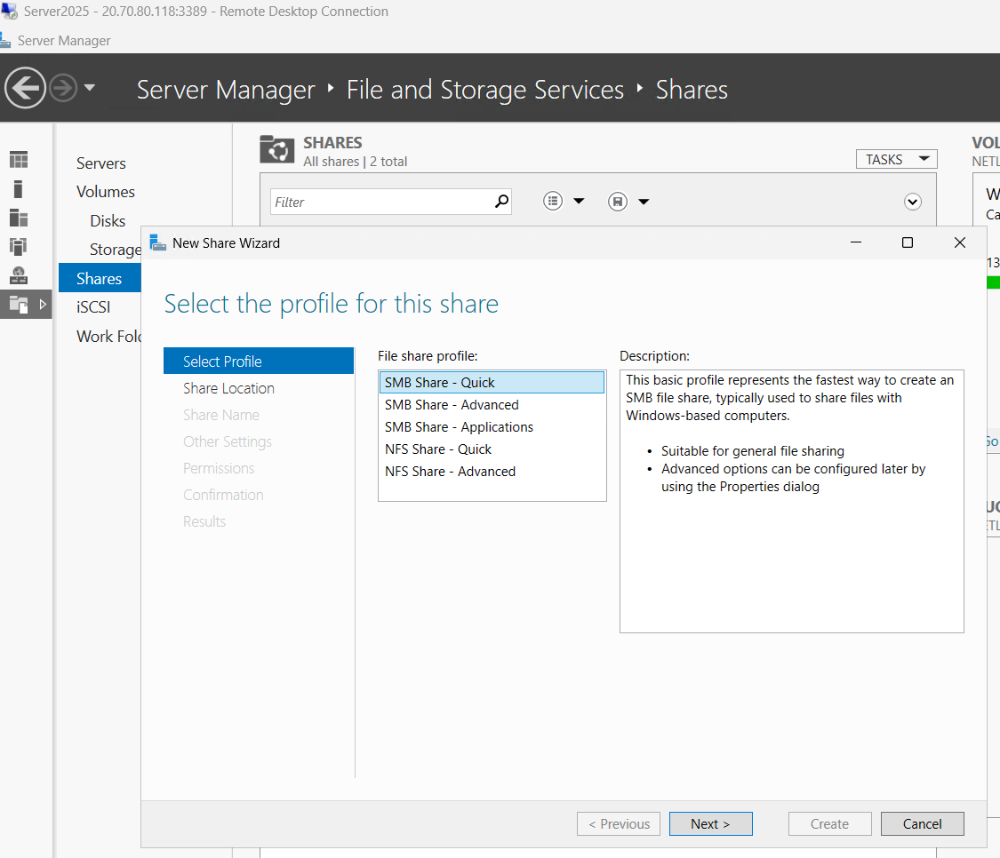
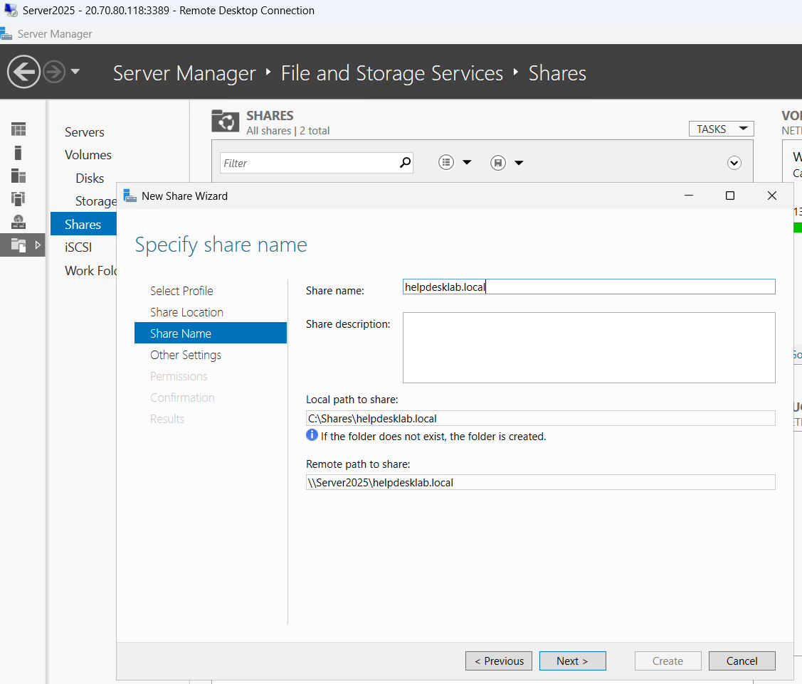
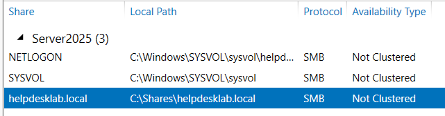
<b>Within the newly created share, create a folder named Home. Open the folder’s properties, go to Advanced Sharing, check Share this folder, and apply. </b>
<br />
<br />
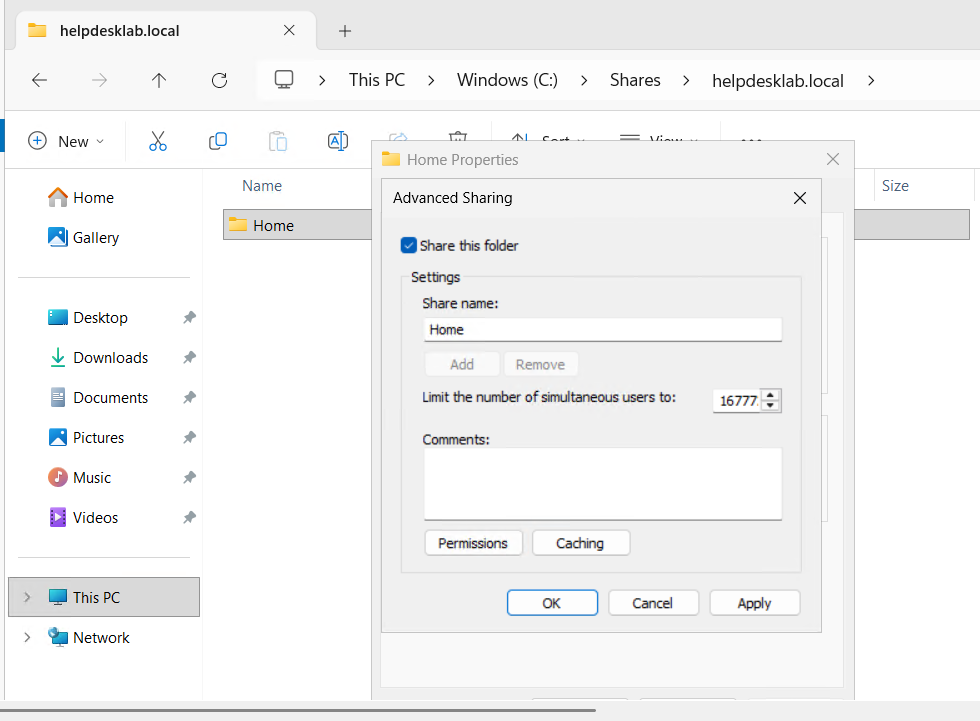
<b>In the share settings, open Security and use Select a principal to add the new domain user (example: john.d). Grant Read/Write/Modify (Modify) permissions. Also verify share-level permissions allow the same access. </b>
<br />
<br />
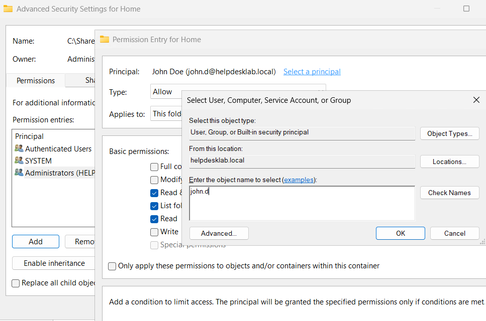
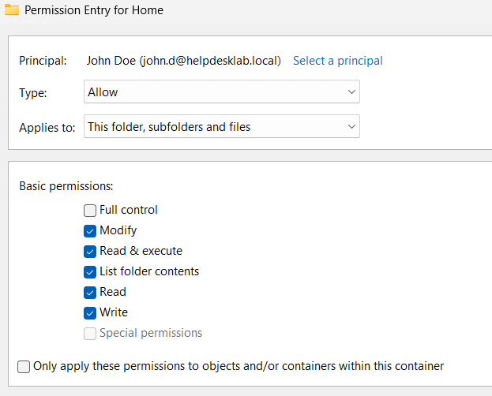
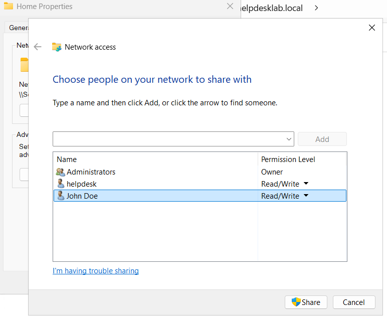
<b> Open Active Directory Users and Computers, edit the new user’s Profile tab, and set the Home folder to connect as drive H: using the correct UNC path (for example: \server-name\helpdesklab.local\Home). Apply the changes. RDP into the Windows 11 VM as the new user, open This PC, and confirm the H: drive is present and that the user can access and modify files in the Home folder.  </b>
<br />
<br />
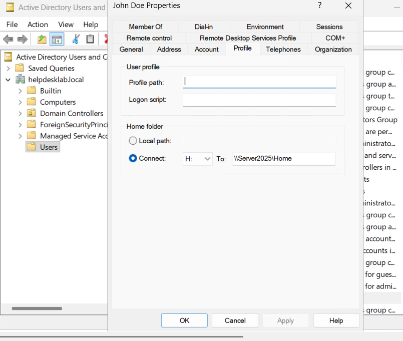
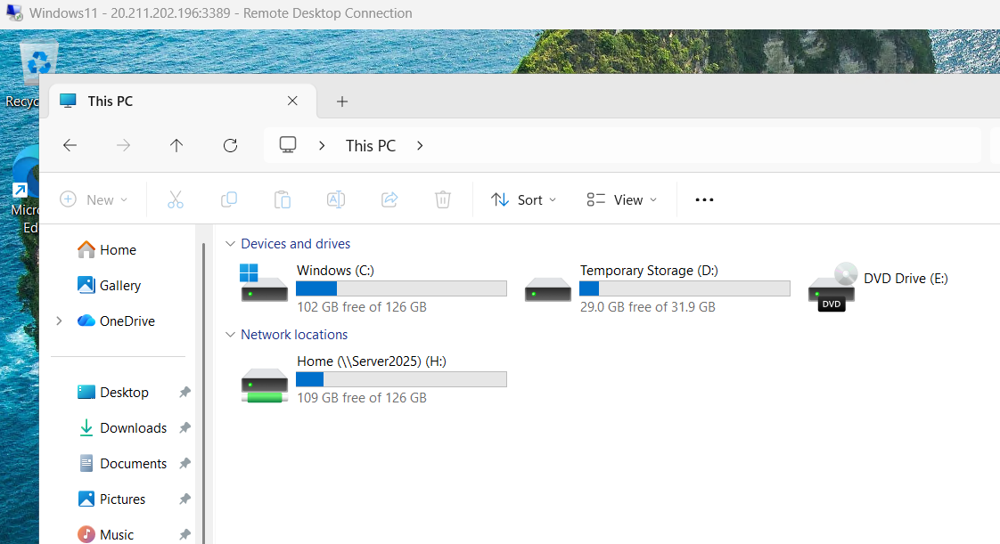
<br />
<br />

</p>

<!--
 ```diff
- text in red
+ text in green
! text in orange
# text in gray
@@ text in purple (and bold)@@
```
--!>
